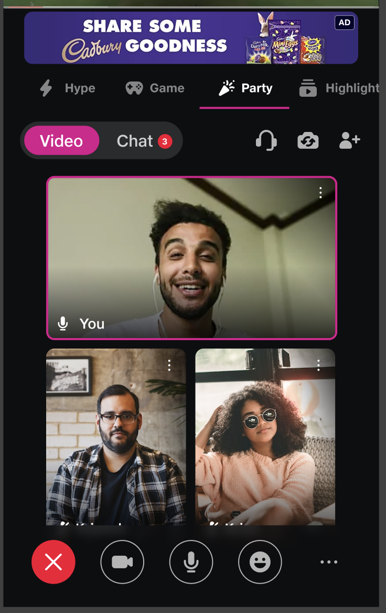

# JioMeetJCWatchPartyTemplateSDK_ANDROID

**Welcome to Jiomeet Watchparty Template UI Kit**, an SDK that simplifies the integration of JioMeet's robust audio and video capabilities, along with exciting features like reactions and chat, into your Android application with minimal coding effort. With just a few simple steps, you can enable high-quality real-time communication, allowing users to effortlessly connect, interact, and enjoy watching content together.


## Introduction

In this documentation, we'll guide you through the process of installation, enabling you to enhance your Android app with Jiomeet's real-time communication capabilities swiftly and efficiently.Let's get started on your journey to creating seamless communication experiences with Jiomeet WatchParty Template UI!



---

## Features

In Jiomeet Template UI, you'll find a range of powerful features designed to enhance your Android application's communication and collaboration capabilities. These features include:

1. **Voice and Video Streaming**:Enjoy high-quality, real-time audio and video streaming while watching content with your friends.

2. **Reactions** Allow participants to express their reactions and emotions while watching, enhancing the sense of togetherness

3. **Chat Integration**: Enable real-time chat for participants to discuss the content, share thoughts, and socialize during the watch party.


## Prerequisites

Before you begin, ensure you have met the following requirements:

Support for Java 11
Support for Android API level 23 or higher

JioMeet Template UI relies on Jetpack Compose for its user interface components.
Ensure that your Android project is configured to use Jetpack Compose. You can add the necessary configurations to your project's build.gradle file:

```gradle
  // Enable Jetpack Compose
  buildFeatures {
      compose true
  }

  // Set the Kotlin compiler extension version for Compose
  composeOptions {
      kotlinCompilerExtensionVersion = "1.3.2"
  }
```

---

## Setup

##### Register on JioMeet Platform:

You need to first register on Jiomeet platform.[Click here to sign up](https://platform.jiomeet.com/login/signUp)

##### Get your application keys:

Create a new app. Please follow the steps provided in the [Documentation guide](https://dev.jiomeet.com/docs/quick-start/introduction) to create apps before you proceed.

###### Get you Jiomeet meeting id and pin

Use the [create meeting api](https://dev.jiomeet.com/docs/JioMeet%20Platform%20Server%20APIs/create-a-dynamic-meeting) to get your room id and password

## QuickStart

- Refer the [Quick Start](./Documents/QuickStart.md) to get Configure JioMeet Core SDK inside your app


## Sample app

Visit our [Jiomeet Watchparty Template UI Sample app](https://github.com/JioMeet/JioMeetJCWatchPartyTemplateSDK_ANDROID) repo to run the Sample app.

---

## Troubleshooting

- Facing any issues while integrating or installing the JioMeet WatchParty Template UI Kit please connect with us via real time support present in jiomeet.support@jio.com or https://jiomeetpro.jio.com/contact-us

---
